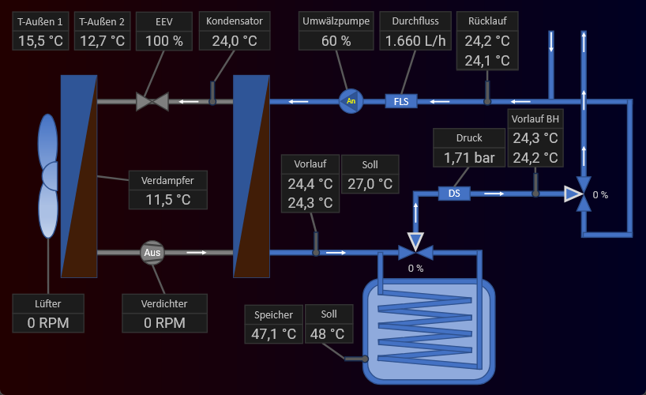
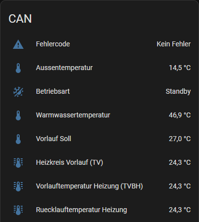
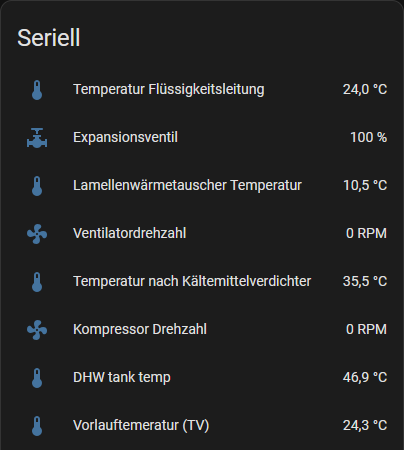
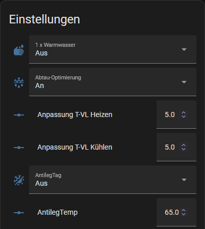
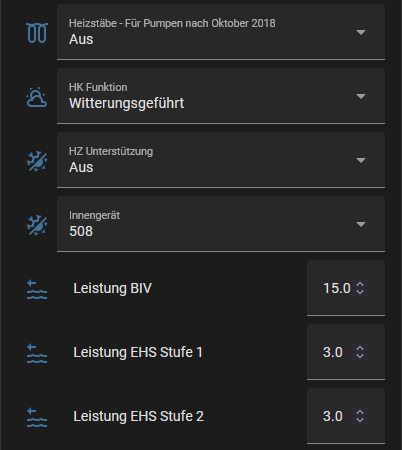
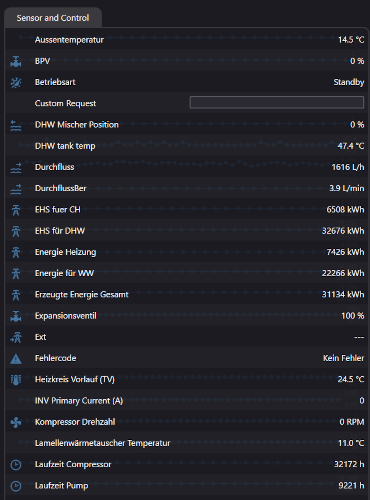
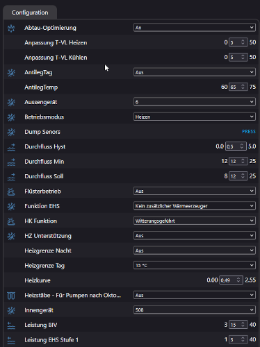

#### Language Selection:

 

# Rotex / Daikin HPSU CAN
**Daikin-Rotex-HPSU-CAN** ist eine flexible Standalone-Lösung zum Auslesen und Steuern von Rotex/Daikin Luftwärmepumpen über den CAN-Bus und/oder die Serielle Schnittselle.
Die Steuerung und der Datenzugriff erfolgen wahlweise über den integrierten Webserver oder bequem über Home Assistant bzw. ioBroker.

## Benötigte Hardware
Als Hardware wird ein **ESP32** benötigt, der eine Baudrate von **20 kbit/s** unterstützt.  
- Erfolgreich getestet wurden das **ESP32-S3-WROOM-Board** und ein **WaveShare ESP32-S3 Mini** in Kombination mit dem kompatiblen **Waveshare SN65HVD230** (3,3V) CAN-Transceiver.
- Eine elegante Lösung, ideal für alle ohne viel Erfahrung mit ESP oder Bastelprojekten, ist das Klick-/Steck-System [ATOM S3 Lite](https://docs.m5stack.com/en/core/AtomS3%20Lite) mit einem [ATOM CAN Modul](https://docs.m5stack.com/en/atom/atom_can).

Eine Übersicht unterstützter ESP32-Varianten und deren unterstützte Bitrate findest du in der folgenden [Tabelle](https://esphome.io/components/canbus/esp32_can).  

## Homeassistant - Dashboard

Das [HPSU Dashboard für Home Assistant](https://github.com/wrfz/daikin-rotex-hpsu-dashboard) ist ein Add-on, das hilft, die Funktionsweise der Wärmepumpe leicht verständlich in Echtzeit nachzuvollziehen.

## Home Assistant - Sensoren

Die CAN- und seriellen Werte des Kältekreises verbessern das Verständnis der Pumpe und erleichtern es, im Falle von Störungen die Ursachen schneller zu erkennen.

## Home Assistant - Einstellungen

Sowohl die üblichen Einstellungen, wie die Soll-Temperaturen für Warmwasser oder Raumheizung, lassen sich bequem aus der Ferne anpassen, als auch spezielle Einstellungen, die das grundlegende Verhalten der Pumpe steuern.

## Integrierter ESP Webserver (ohne Home Assistant nutzbar)

Der in ESP integrierte Webserver ist ideal für technisch weniger versierte Nutzer, die eine unkomplizierte Lösung suchen, um die Wärmepumpe remote zu steuern und schnell einen Überblick über alle relevanten Werte zu erhalten, ohne auf Home Assistant zurückgreifen zu müssen.
 

# Achtung!!
Die Verwendung von Daikin-Rotex-HPSU-CAN kann potenziell Ihr Heizsystem beschädigen. Die Nutzung erfolgt auf eigene Verantwortung. Ich übernehme keine Haftung für entstandene Schäden.

Bitte beachten Sie, dass durch die Verwendung von Daikin-Rotex-HPSU-CAN möglicherweise Ihre Garantie sowie der Support durch den Hersteller erlischt!

# Installationsanleitung (Standalone):

### Schritt 1: Vorbereitung

1. **Browser:** Verwende **Google Chrome** (Safari und Firefox werden nicht unterstützt).
2. **Firmware:** Lade die Datei [rotex.factory-tx05-rx06.bin](bin/rotex.factory-tx05-rx06.bin) aus dem [bin](bin/)-Ordner herunter.

### Schritt 2: ESP32 flashen

1. Öffne die Webseite [https://web.esphome.io](https://web.esphome.io).
2. Verbinde den ESP32 per USB-C-Kabel mit deinem PC.
3. Klicke auf der Webseite auf „**Connect**“ und wähle im erscheinenden Fenster die USB-Serial-Schnittstelle aus.
4. Klicke anschließend auf „**Installieren**“.
5. Wähle die heruntergeladene Datei `rotex.factory-tx05-rx06.bin` aus und klicke erneut auf „**Installieren**“. Der Vorgang dauert etwa 2 Minuten.

### Schritt 3: WLAN-Verbindung des ESP32 konfigurieren

1. Starte den ESP32 neu und warte ca. 1–2 Minuten, bis der „Rotex Fallback Hotspot“ vom ESP32 erstellt wird.
2. Verbinde dich mit dem Hotspot (Passwort: `H3jGqANSa7aL`).
3. Öffne die Webseite [http://192.168.4.1](http://192.168.4.1) oder [http://rotex.local](http://rotex.local) im Browser.
4. Gib deine WLAN-SSID und dein WLAN-Passwort ein, um den ESP32 mit deinem Netzwerk zu verbinden.

### Schritt 4: Prüfung der Netzwerkverbindung

- Der ESP32 sollte nun über [http://rotex.local](http://rotex.local) erreichbar sein.  
- Falls dies nicht funktioniert, überprüfe bitte die IP-Adresse des ESP32 in deinem Router.

## Abschluss

Die Installation ist nun abgeschlossen, und das System kann nach den Schaubild **Pinbelegung GPIO 5 und 6 (Bin Datei)** mit der Rotex/Daikin-Anlage verbunden werden.

# Rotex/Daikin HPSU CAN Integration mit ESPHome und Home Assistant

Diese Anleitung beschreibt, wie du deine Rotex HPSU Compact über CAN-Bus mithilfe eines ESP32 und ESPHome in Home Assistant integrieren kannst, ohne mehrfaches Flashen durchzuführen.

## Voraussetzungen
- Home Assistant mit ESPHome Addon
- ESP32-S3 Mikrocontroller
- USB-C-Kabel für die initiale Verbindung

## Schritt 1: ESPHome Addon in Home Assistant installieren
1. Öffne Home Assistant und gehe zu **Einstellungen > Addons > ESPHome**.
2. Installiere das ESPHome Addon und starte es anschließend.
3. Öffne die Benutzeroberfläche des ESPHome Addons.

## Schritt 2: ESP32 in ESPHome konfigurieren und initiales Flashen
1. In der ESPHome-Oberfläche klicke auf **„New Device“**.
2. Gib einen Namen für das Gerät ein (z.B. `Rotex_HPSU`) und wähle die Plattform **ESP32-S3**.
3. Gib die WLAN-SSID und das WLAN-Passwort deines Heimnetzwerks ein, damit der ESP32 später automatisch verbunden wird.
4. Lade die Konfigurationsdatei herunter, die für das einmalige Flashen benötigt wird.
5. **Verbinde den ESP32 per USB-C-Kabel mit dem Computer, auf dem Home Assistant läuft** (oder einem anderen Computer im Netzwerk mit ESPHome).
6. Wähle die Option **„Plug into this computer“** und folge den Anweisungen, um den ESP32 direkt aus ESPHome heraus zu flashen.
7. Nach erfolgreichem Flashen verbindet sich der ESP32 automatisch mit deinem WLAN und erscheint in der ESPHome-Liste in Home Assistant.

## Schritt 3: Konfiguration in ESPHome anpassen und drahtlos aktualisieren
1. In ESPHome wähle das hinzugefügte Gerät (z.B. `Rotex_HPSU`) und klicke auf **„Edit“**, um die Konfigurationsdatei zu bearbeiten.
2. Ersetze den Inhalt der Datei mit der Konfigurationsdatei [`examples/full.yaml`](https://github.com/Columbo/Daikin-Rotex-HPSU-CAN/blob/main/examples/full.yaml), die für deine Rotex HPSU Compact optimiert ist.
3. Speichere die Änderungen und klicke auf **„Install“**. Die Konfiguration wird nun drahtlos an den ESP32 gesendet, ohne dass ein erneutes Flashen per USB erforderlich ist.

## Schritt 4: ESP32 in Home Assistant einbinden
1. Der ESP32 sollte automatisch als neues Gerät in Home Assistant erkannt werden.
2. Gehe zu **Einstellungen > Geräte & Dienste** und prüfe, ob das Gerät (z.B. `Rotex_HPSU`) hinzugefügt wurde.
3. Die konfigurierten Sensoren und Steuerungen sollten nun in Home Assistant verfügbar sein und sind bereit zur Nutzung.

---

Damit wird der Installations- und Konfigurationsprozess effizienter gestaltet, da das mehrmalige Flashen entfällt.

---

## Abschluss

Die Installation ist nun abgeschlossen, und du kannst den ESP32 gemäß den Schaubildern mit der Rotex/Daikin-Anlage verbinden.

**Hinweis**: Weitere Sensoren oder Steuerungen können einfach durch das Hinzufügen neuer Einträge in der ESPHome yaml-Konfiguration ergänzt werden.

  

## Features:

- 1x Warm Wasser Taste ohne Heizstab (es wird für 10s auf 70Grad gestellt und dann wieder auf den vorher eingestellten Wert zurück)
- Thermische Leistungsberechnung
- Heizkurven Verstellung in 0.01 Schritten (Standard in 0.1 Schritten)
- Zwei neue Schalter angelegt um auch die Thermostat Eingänge von der Rotex / Daikin direkt zwischen Heizen / Kühlen umzuschalten.
- Neues Feature Fehlercode Anzeige mit Beschreibung des Fehlers mit Handbuch Seitenangabe!!
  
   

Wer Abtauprobleme hat, kann das neue Feature "Defrost" direkt über den ESP nutzen. So wird max 0.7 Grad Warmwasser aus dem Sepicher verbraucht.

Getestet mit: 
- Rotex HSPU Compact 508 8kw mit Rocon BM1, 
- ROTEX HPSU compact Ultra
- Dakin ECH2O (bis 01/2022)

## Pinbelegung GPIO 5 und 6 (Bin Datei)

## Pin Belegung an der Rotex HPSU

## DIY Platine von (Dornieden)

mehr dazu im Discusions Forum https://github.com/Trunks1982/Daikin-Rotex-HPSU-CAN/discussions/35:  
https://github.com/Trunks1982/Daikin-Rotex-HPSU-CAN/blob/main/DIY-Platine/README

# Telegram Gruppenchat
https://t.me/+C1iVhAjaENw0ODY0

  
"Ein Kaffee für nächste lange Nacht vor dem Rechner wäre toll" ist aber natürlich kein muss.
 

